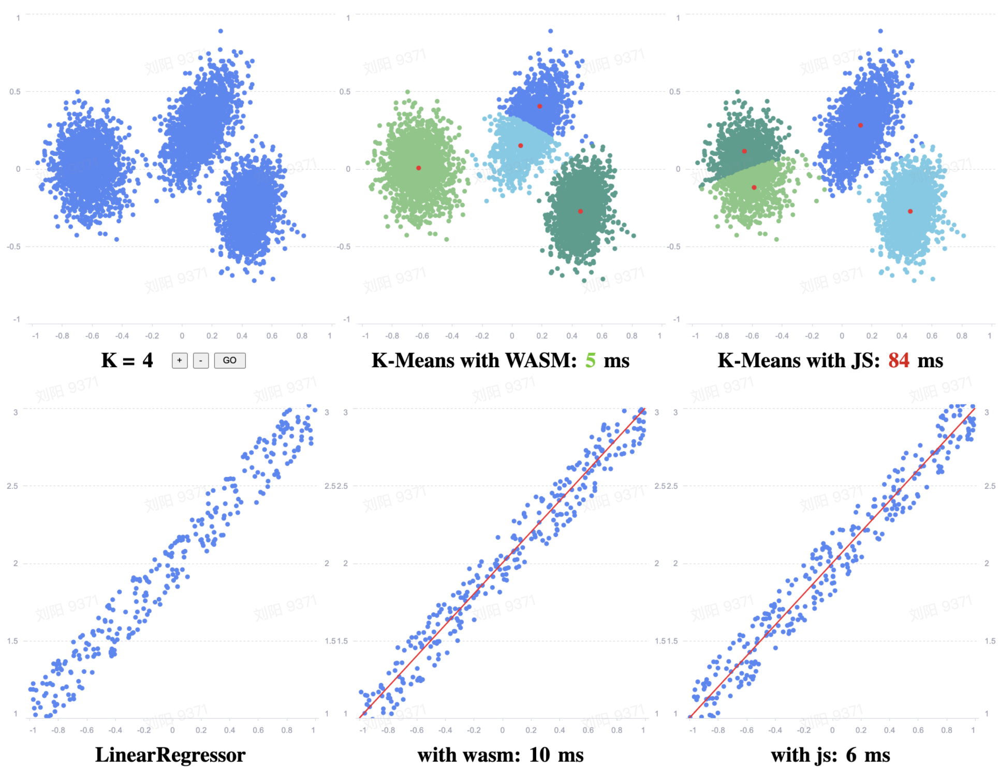

# WASM K-Means



## Usage

### Install Emscripten 
First you need to install emscripten toolchain, see [Getting Started](https://emscripten.org/docs/getting_started/index.html)

### Run Demo
Install node modules
```
npm install
```

run the demo on browser
```
npm run dev
```

Build c to webassembly
```
npm run wasm 
```

package staff
```
npm run build
```
